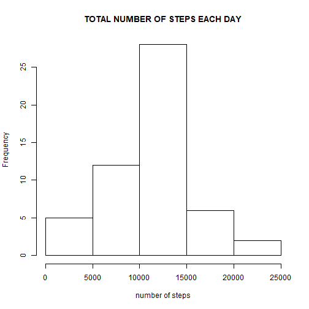
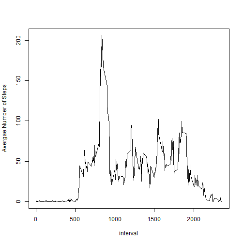
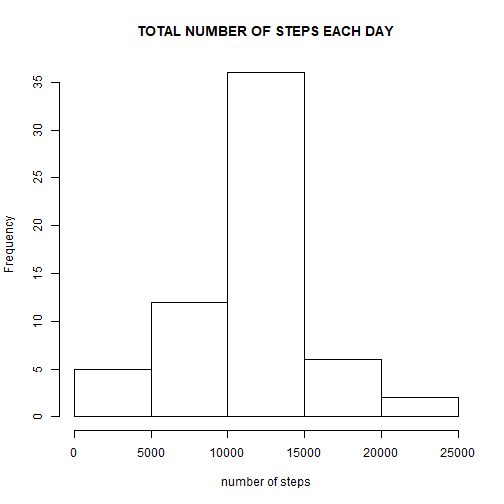
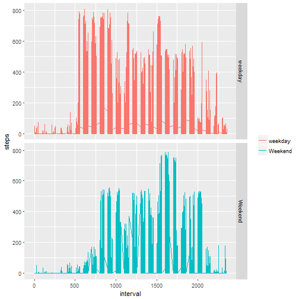

WEEK 2 PROJECT - REPRODUCIBLE RESEARCH
========================================

This file contains codes, texts and figures for the 2nd week project for reproducible research course.

## Reading Data from csv file 

```r
a<-read.csv("~/GitHub/RepData_PeerAssessment1/activity/activity.csv")
```
###load necessary libraries

```r
library(lubridate)
library(dplyr)
library(ggplot2)
```

## The total number of daily steps


```r
sum(a$steps, na.rm = TRUE)
```

```
## [1] 570608
```

## Histogram of the total number of steps per day


```r
m<-group_by(a,date)
n<-summarize(m, st=sum(steps), na.rm=TRUE)
hist(n$st, main = "TOTAL NUMBER OF STEPS EACH DAY", xlab = "number of steps")
```



## The mean and median of number of steps per day

```r
mean<-mean(n$st, na.rm=TRUE)
mean
```

```
## [1] 10766.19
```

```r
median<-median(n$st, na.rm=TRUE)
median 
```

```
## [1] 10765
```

### The MEAN of the number of steps per day is 1.0766189 &times; 10<sup>4</sup>.
### The MEDIAN of the number of steps per day is 10765.


## Average Daily Activity Pattern


```r
m1<-group_by(a,interval)
n1<-summarize(m1, avst=mean(steps, na.rm=TRUE))
plot(n1$interval, n1$avst, type = "l", xlab= "interval", ylab= "Avergae Number of Steps")
```



```r
max<-max(n1$avst, na.rm = TRUE)
max
```

```
## [1] 206.1698
```

```r
t<-a$interval[which.max(n1$avst)]
t
```

```
## [1] 835
```
###The 5-minute time interval number 835 has the maximum number of steps which is 206.1698113 steps.

## Number of Missing Values

```r
length(which(is.na(a)))
```

```
## [1] 2304
```

### The mean value of the number of steps per interval will be used to fill the missing values(NA), and a new dataset (a1) is created.

```r
a1<-a
a1$steps[is.na(a1$steps)]<-n1$avst
```
###  Histogram of the total number of steps per day after imputing missing values


```r
m2<-group_by(a1,date)
n2<-summarize(m2, st2=sum(steps), na.rm=TRUE)
hist(n2$st2, main = "TOTAL NUMBER OF STEPS EACH DAY", xlab = "number of steps")
```



## The mean and median of number of steps per day

```r
mean<-mean(n2$st2, na.rm=TRUE)
mean
```

```
## [1] 10766.19
```

```r
median<-median(n2$st2, na.rm=TRUE)
median 
```

```
## [1] 10766.19
```

### The pattern of the histogram of total daily steps changed after imputing missing values, resulted in less varaiationa with respect to days. However, mean and median values almost has not changed

## Create a new factor variable in the dataset with two level (i.e. weekend and weekday)
###generate a panel of two plots to show the daily steps during weekdays and weekdends. 


```r
da<-as.Date(a1$date)
a1<-cbind(a1, da)
a1<-mutate(a1, w=weekdays(da))
a1$wday<-"weekday"
a1[a1$w %in% c('Saturday', 'Sunday'),]$wday<-"Weekend"
a1<-mutate(a1, wday1=as.factor(wday))
ggplot(a1, aes(x = interval, y = steps, color=wday1))+ geom_line()+facet_grid(wday1~.)+labs(col="")
```


